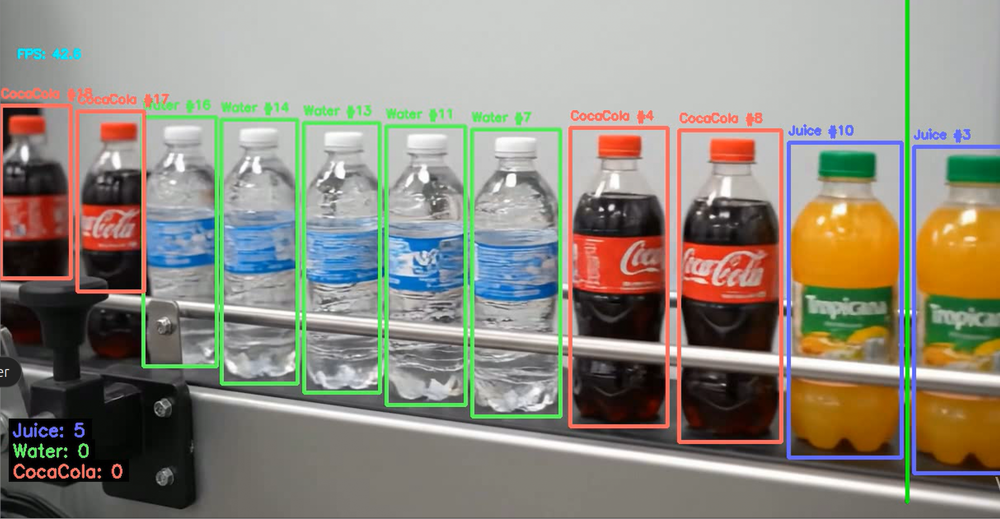

## Object-Counting-Bottles

This project is about detecting, tracking and counting Juice, Water, and CocaCola bottles in videos using the YOLOv8 object detection model. 

### Features
- Detects and tracks bottles in video files
- Counts objects crossing a defined line (IN/OUT)
- Visualizes bounding boxes, labels, and info panels
- Outputs processed video and JSON results

### Requirements
See `requirements.txt` for dependencies.

### ⚙️ Setup
1. Clone this repository.
2. Place your YOLOv8 model weights file (e.g., `best.pt`) in the project directory.
3. Place your input video file (e.g., `video3.mp4`) in the project directory.
4. Install dependencies:
   ```bash
   pip install -r requirements.txt
   ```

### 🚀 Usage
Run the main script:
```bash
python run_main.py
```

### Output
- Annotated video with bounding boxes and counts
- JSON file with total counts per class



### Notes
- Requires a trained YOLOv8 model (`best.pt`).
- Adjust the counting line and class names in `run_main.py` as needed.

### License

[LICENSE](LICENSE) 

### 🙏 Acknowledgments
[Ultralytics YOLO](https://github.com/ultralytics/ultralytics)

